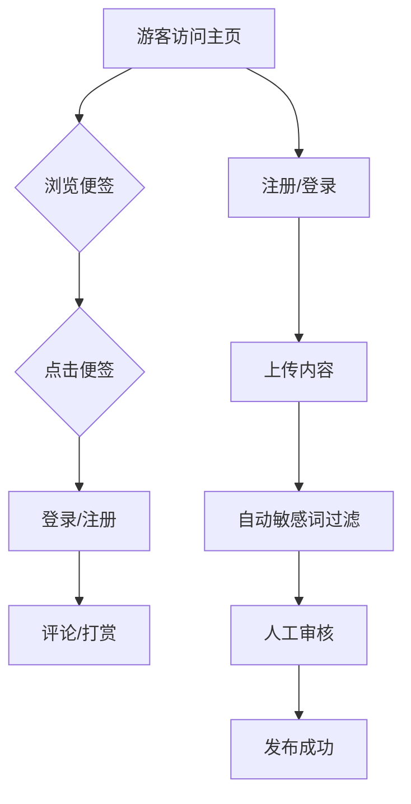

# 产品需求文档 (PRD) - 生活小确幸

## 0. 为什么想做

我们生活中总会有一些让我们强烈地感觉到幸福和被爱的瞬间 ，比如可以在清晨里看着充满烟火气的小摊，冬日包子摊里包子蒸着的香气。坐在公交车上听着喜欢的歌，在窗边看着倒退的风景。去菜市场，看看人来人往，听听对着菜讨价还价的声音。
这些瞬间就算很抽象，也尽量用文字或者语言记录、表达和分享出来。让我们培养自己对「幸福小事」的具象化，留住这些细碎流动的美好。

## 1. 产品概述

### 1.1 产品定位
- **核心价值**：治愈感的UGC平台，帮助用户记录并回看幸福瞬间，通过轻社交互动传递积极情绪。
- **目标用户**：18-35岁注重生活仪式感的年轻人，偏好碎片化内容分享与轻量化社交。

### 1.2 产品愿景
构建一个温暖、无压力的内容社区，让用户通过记录微小幸福获得情感共鸣与正向能量。

### 1.3 产品简介
我们生活中总会有一些让我们强烈地感觉到幸福和被爱的瞬间 ，可能是一杯加了冰块的冰可可，让我们培养自己对「幸福小事」的具象化，那些瞬间就算很抽象，也尽量用文字或者语言记录和表达出来。

## 2. 核心功能模块

### 2.1 用户内容上传
- **功能描述**：
  - 用户登录后，可上传文字（限500字内）+图片（JPG/PNG，≤5MB）/音频（MP3，≤5MB）。
  - 内容自动套用系统统一模板（不可自定义样式）。
- **审核机制**：
  - **自动过滤**：接入开源中文敏感词库（如GitHub ciku5项目）。
  - **人工审核**：后台管理界面推送待审内容，管理员（你）手动审核后发布。

### 2.2 主页展示与互动
- **内容展示逻辑**：
  - **混合推荐**：70%随机展示 + 30%按热度（点赞+打赏数加权）优先展示。
  - **懒加载**：用户滚动时逐步加载便签，首屏加载10条，后续每次加载5条。
- **互动功能**：
  - **游客**：仅可浏览、点赞。
  - **登录用户**：可评论、打赏（固定1元/次）。

### 2.3 个人页面
- **功能清单**：
  - 查看/删除已发布的便签（不可编辑）。
  - 查看收益记录（需对接支付流水数据）。
  - **未来扩展**：年度幸福日记生成（按时间轴聚合内容）。

### 2.4 搜索功能（MVP暂缓）
- **未来规划**：支持按关键词、标签或日期检索便签。

## 3. 用户

### 3.1 核心流程

下图展示了用户的核心交互流程：

**流程文字描述:**

**路径1: 游客互动流程**
1.  **游客访问主页**: 用户打开应用首页。
2.  **浏览便签**: 游客可以自由浏览其他用户发布的"小确幸"便签。
3.  **点击便签**: 当游客对某个便签感兴趣并点击它时，如果想进行评论或打赏等操作：
4.  **登录/注册**: 系统会提示并引导游客进行登录或注册。
5.  **评论/打赏**: 登录成功后，用户即可对便签进行评论或打赏。

**路径2: 用户内容上传流程**
1.  **游客访问主页 / 已登录用户**:
    *   如果是游客，首先需要 **注册/登录**。
    *   如果已登录，则直接进入下一步。
2.  **上传内容**: 登录用户可以创建并上传自己的"小确幸"内容（文字、图片/音频）。
3.  **自动敏感词过滤**: 系统自动对上传内容进行敏感词检测。
4.  **人工审核**: 通过自动过滤的内容会进入后台，由管理员进行人工审核。
5.  **发布成功**: 内容通过人工审核后，正式发布成功，其他用户可见。

### 3.2 关键规则
- **打赏限制**：每用户对单便签仅可打赏1次，金额固定1元。
- **内容删除**：用户可删除自己的便签，但收益记录保留。

## 4. 非功能需求

### 4.1 性能要求
- **响应速度**：主页首屏加载时间≤3秒，懒加载增量内容≤2秒。
- **兼容性**：支持Chrome/Firefox/Safari最新版本，移动端适配。

### 4.2 安全与合规
- **文件安全**：限制上传格式（JPG/PNG/MP3），后端校验文件头防伪造。
- **支付合规**：
  - 打赏需绑定微信/支付宝账号（用户需完成平台实名认证）。
  - 根据中国法规，用户打赏前需弹窗提示"自愿赠与"声明。

## 5. 技术实现方案

### 5.1 技术栈选择
- **前端**：
  - 使用NoCode工具（如V0.dev + Figma设计稿转代码）实现页面。
  - React+Tailwind Css
- **后端**：
  - 数据库：Supabase（集成用户认证与数据存储）。
  - Python+FastAPI
  - 支付接口：支付宝/微信官方SDK（需企业资质，若个人开发可暂用第三方聚合支付如Ping++）。
- **审核系统**：
  - 敏感词库：GitHub开源项目ciku5词库 + 自定义补充词。
  - 人工审核后台：基于Airtable搭建简易管理界面。

### 5.2 实名认证流程优化
- **简化步骤**：用户绑定微信/支付宝时自动获取实名信息，无需二次认证。

## 6. 开发计划 (PRD原文此处有表格，已转换为列表)

### 6.1 MVP阶段（4-6周）

| 功能                 | 优先级 | 实现方式               |
| -------------------- | ------ | ---------------------- |
| 用户登录/注册        | P0     | Supabase Auth          |
| 内容上传与审核（再看） | P0     | Supabase存储           |
| 主页懒加载展示（无所谓） | P1     | V0.dev组件             |
| 点赞/评论            | P1     | Supabase实时数据库     |
| 打赏功能             | P0     | 微信SDK测试环境集成    |

### 6.2 后续迭代

| 阶段   | 功能                 | 目标                     |
| ------ | -------------------- | ------------------------ |
| 阶段1  | 算法推荐（热度加权）   | 提升用户留存             |
| 阶段2  | 标签分类与搜索       | 提高内容发现效率         |
| 阶段3  | 年度幸福日记生成     | 增加用户粘性与情感价值   | 